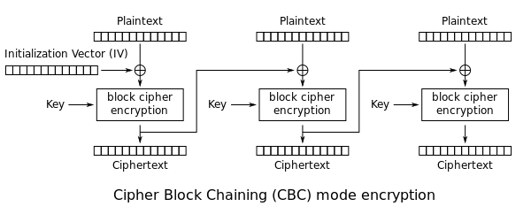
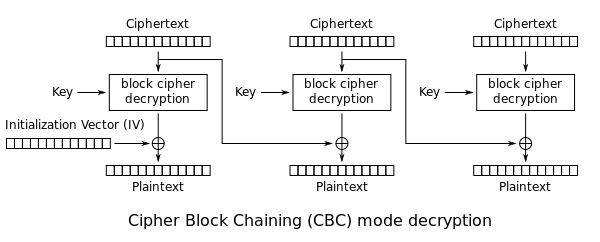
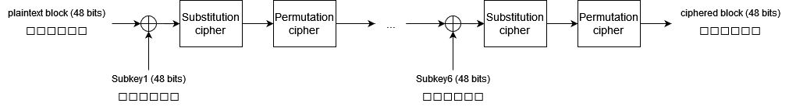
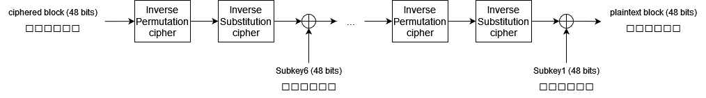
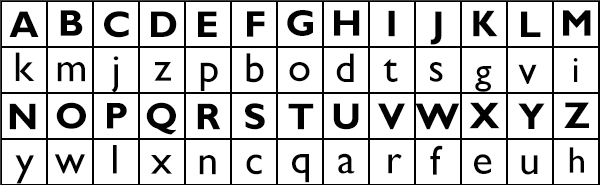
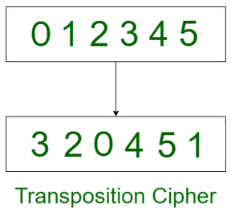

# Repositório para o trabalho T4 da cadeira de Teoria da Informação
### Objetivo do T4:
Elaborar um **cifrador simétrico de bloco** (para blocos de 48 bits), que permita criptografar e decriptografar um arquivo (de qualquer tamanho) utilizando uma chave de 32 bits (o valor da chave é inicialmente fornecido pelo usuário como valor de entrada do processo de **key scheduling**). Implementar também a camada do modo de operação, que deve ser o modo **CBC**.
## Modo de usar
Na raíz do projeto está o executável `entrypting.jar`, a partir dele é possível rodar o programa passando argumentos no formato `chave:valor` para parametrizá-lo (apesar de todos os parâmetros terem valores padrão, fazendo com que nenhum seja obrigatório).
### Exemplo de execução: 
```bash
$ java -jar encrypting.jar action:encryptAndDecrypt file:alice29.txt key:28292A2B

---- Par▒metros aplicados: ----
        action:encryptAndDecrypt
        file:alice29.txt
        key:28292A2B
        USER_KEY_SIZE:4
        BLOCK_SIZE:6
-------------------------------

key: [40, 41, 42, 43]
Encrypted C:\git\encrypting\alice29.txt to C:\git\encrypting\alice29.ecc
Decrypted C:\git\encrypting\alice29.ecc to C:\git\encrypting\alice29.dcc

```
Argumentos recebidos por linha de comando:
* **action**
  * Tipo: String
  * Valor padrão: ´encryptAndDecrypt´
  * Descrição: Define qual fluxo será executado, tem as seguintes opções:
    * `encrypt`: realiza o ciframento em blocos do arquivo especificado para um arquivo `[nome].ecc`;
    * `decrypt`: realiza o deciframento do arquivo especificado para um arquivo `[nome].dcc`;
    * `encryptAndDecrypt`: realiza ambas, gera os arquivos `[nome].ecc` --> `[nome].dcc`;

* **file**
  * Tipo: String
  * Valor padrão: `alice29.txt`
  * Descrição: Caminho do arquico que será codificado (caso a ação seja `encrypt` ou `encryptAndDecrypt`) ou decodificado (caso a ação seja `decrypt`).

* **key**
  * Tipo: String
  * Valor padrão: `01020304`
  * Descrição: chave de 32 bits que será usada para o Key Schedule do processo de ciframento. Deve estar no formato de 4 bytes **hexadecimais** concatenados.

 **Obs.:** `USER_KEY_SIZE` e `BLOCK_SIZE` não são editáveis.

---
## Passos da Encriptação


### Modo de Operação - Cipher block chaining (CBC)
O modo de operação CBC consiste na divisão em blocos da informação que se deseja encryptar. Antes do ciframento de cada bloco, é aplicada uma operação XOR com o resultado do ciframento do bloco anterior (com a exceção do primeiro, que sofre XOR com um vetor pré-definido). Em cima do bloco resultante desse XOR é aplicado o [ciframento](#ciframento) usando as chaves geradas a partir do [key schedule](#key-schedule).



O deciframento consiste em aplicar os mesmos passos, mas na ordem **inversa**:



Para esse trabalho, os tamanhos dos blocos e das chaves é de 48 bits (6 bytes);
### Key Schedule
A chave do usuário de 32 bits, antes de ser consumida, é expandida para 48 bits, nessa operação é realizada a replicação dos 16 primeiros bits, por exemplo: A chave (em hex) ```0x28 0x2A 0x2C 0x2E``` será expandido para ```0x28 0x2A 0x2C 0x2E 0x28 0x2A```.
Após a expansão, essa chave passa por XOR com um vetor de inicialização, e o resultado será usado para fazer o *key scheduling*, onde é realizado um shift para a esquerda da chave em um byte, essa operação é realizada 6 vezes, gerando 6 chaves. Exemplo:
subkey1: ```0x11 0x22 0x33 0x44 0x55 0x66```
subkey2: ```0x22 0x33 0x44 0x55 0x66 0x11```
subkey3: ```0x33 0x44 0x55 0x66 0x11 0x22```
subkey4: ```0x44 0x55 0x66 0x11 0x22 0x33```
subkey5: ```0x55 0x66 0x11 0x22 0x33 0x44```
subkey6: ```0x66 0x11 0x22 0x33 0x44 0x55```

### Ciframento/Deciframento de blocos
Para cada bloco do CBC é realizado o passo de encriptação, dentro dele são executados os seguintes passos (Que são repetidos para cada uma das 6 chaves geradas no [key schedule](#key-schedule)):
* XOR com a chave correspontrente ao passo atual (1 a 6);
* Confusão utilizando [Cifra de Substituição](#cifra-de-substituição)
* Difusão utilizando [Cifra de Permutação](#cifra-de-permutação)



Para a decriptação, são realizados os mesmos passos mas no modo **inverso**, e indo da chave 6 até a 1.



#### Cifra de Substituição
Para confusão, foi utilizada uma cifra de substituição, onde as codewords são mapeados para outras seguindo uma matriz de substituição. Exemplo de cifra:



Para este trabalho foi utilizada uma matriz arbitrária, gerada aleatoriamente, que pode ser encontrada na classe ```br.unisinos.cipher.Cipher.substitutionMatrix```.

#### Cifra de Permutação
Para difusão, foi utilizada uma técnica de transposição onde é feita a permutação dos codewords, trocando-as de posição com base em uma matrix de transposição:



Para este trabalho foi utilizada uma matriz arbitrária, que pode ser encontrada na classe ```br.unisinos.cipher.Cipher.transpositionMatrix```.
